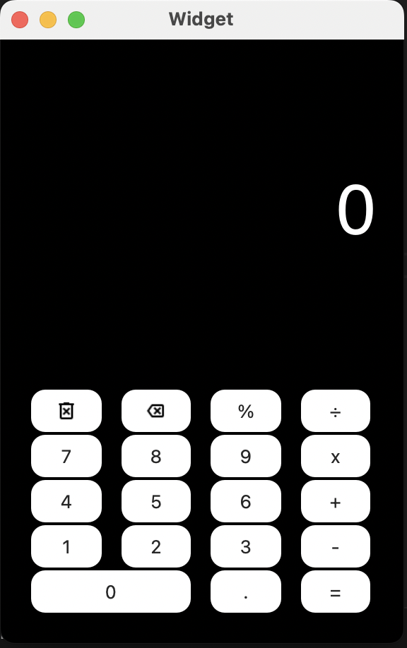

# Калькулятор на Python, сдеаланный на основе фреймворка QTCreator и с использованием библиотеки PySide6



## Требования

- Python 3.10
- PySide6

## Установка зависимостей

Выполните следующую команду, чтобы установить необходимые зависимости:

```pip install PySide6```

## Запуск

1. Клонируйте репозиторий:

```git clone https://github.com/ваш-логин/ваш-репозиторий.git```

2. Перейдите в папку src, а затем в папку calc_with_python:

```cd src```
'\n'
```cd calc_with_python```

3. Запустите калькулятор:

```python widget.py```

## Использование

- Введите числа и используйте кнопки операций для выполнения арифметических операций.
- Нажмите "=", "Enter" или "Return" для выполнения вычислений.
- "Backspace" удаляет последний символ.
- "Delete" удаляет всё введенное.
- "+/-" меняет знак числа.
- "." и "," добавляют десятичную точку.
- P/S Помимо интерактивных кнопок можно использовать цифры на клавиатуре
- P/S При очень большом числе нужно двигать окно приложения

## Структура проекта

- `widget.py`: Главный файл приложения-калькулятора.
- `form_ui.py`: Автоматически сгенерированный файл интерфейса.
- `form.ui`: Файл интерфейса, созданный в Qt Designer.
- `pictures`: Папка с изображениями.
