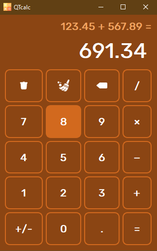

# Калькулятор на Python с использованием PySide6



## Требования

- Python 3.x
- PySide6

## Установка зависимостей

Выполните следующую команду, чтобы установить необходимые зависимости:

```pip install PySide6```

## Запуск

1. Клонируйте репозиторий:

```git clone https://github.com/ваш-логин/ваш-репозиторий.git```

2. Перейдите в папку проекта:

```cd QTcalc```

3. Запустите калькулятор:

```python main.py```

## Использование

- Введите числа и используйте кнопки операций для выполнения арифметических операций.
- Нажмите "=", "Enter" или "Return" для выполнения вычислений.
- "Backspace" удаляет последний символ.
- "Delete" удаляет всё введенное.
- "+/-" меняет знак числа.
- "." и "," добавляют десятичную точку.

## Структура проекта

- `main.py`: Главный файл приложения.
- `ui_form.py`: Автоматически сгенерированный файл интерфейса.
- `form.ui`: Файл интерфейса, созданный в Qt Designer.
- `icons/`: Папка с иконками.
- `fonts/`: Папка со шрифтом.
- `screenshots/`: Папка с скриншотами.